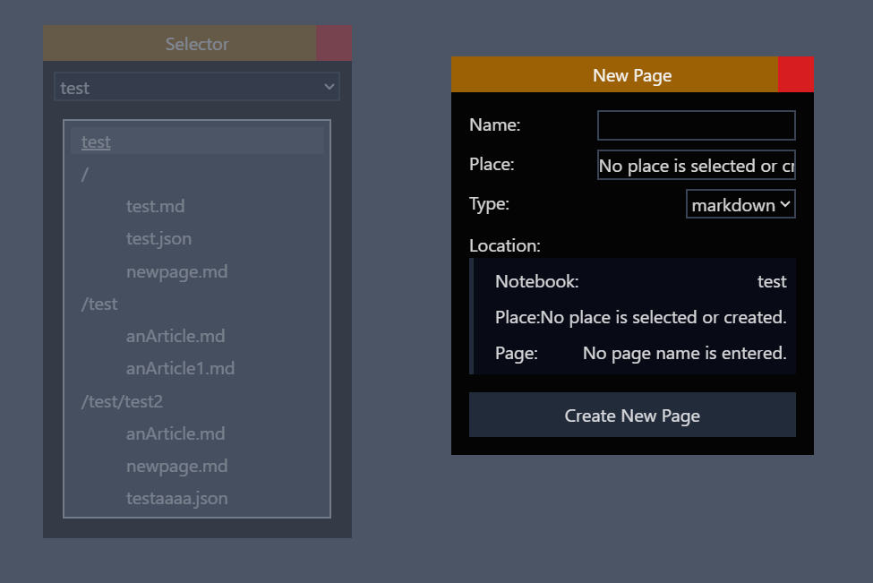

# OverlayWindow
## Role
 Create and manage window for any contents. Any element can be the inside of this window.  

## Sample image


## Usage
 This is the example code of `src\modules\tools\notebookAndPages\selector.tsx`.

```tsx
...
import { OverlayWindow, type OverlayWindowArgs } from "../../MainUI/UIparts/OverlayWindow";
import { type toggleable } from "../../MainUI/ToggleToolsBar";
import { useStartButtonStore } from "../../MainUI/UIparts/ToggleToolsBar/StartButton";
...
    const toolbarAddTool = useStartButtonStore((s) => s.addToggleable)
    const removeToggleable = useStartButtonStore((s) => s.removeToggleable)
...
    // For toolsBar (mandatory) --------------------------
    // For toolsBar (mandatory) --------------------------
    const toggleable:toggleable = {
        name: "Selector",
        menu: "notebooksAndPages",
        color: "bg-blue-700",
        setVisibility: setVisible,
        visibility:visible
    }
    // For toolsBar (mandatory) --------------------------
    // For toolsBar (mandatory) --------------------------

    let windowArg:OverlayWindowArgs = {
        title: "Selector",
        toggleable: toggleable,
        visible: visible,
        setVisible: setVisible,
        color: "bg-yellow-700",
        initPos: {x:100,y:100}
    } 

    // For toolsBar (optional) --------------------------
    // For toolsBar (optional) --------------------------
    useEffect(() => {
        toolbarAddTool("notebooksAndPages",toggleable)

        return () => {
            removeToggleable("notebooksAndPages",toggleable)
        }
    },[])
    // For toolsBar (optional) --------------------------
    // For toolsBar (optional) --------------------------
...
    if (index == null) {
        return (
            <OverlayWindow arg={windowArg}>
                // anything whatever you want can be here.
                <SelectorOutline>
                    <ShowError message="Unable to show this index." />
                </SelectorOutline>
            </OverlayWindow>
        );
    } else {
        return (
            <OverlayWindow arg={windowArg}>
                // anything whatever you want can be here.
                <SelectorOutline>
                    <CreateList index={index} />
                </SelectorOutline>
            </OverlayWindow>
        );
    }
```


